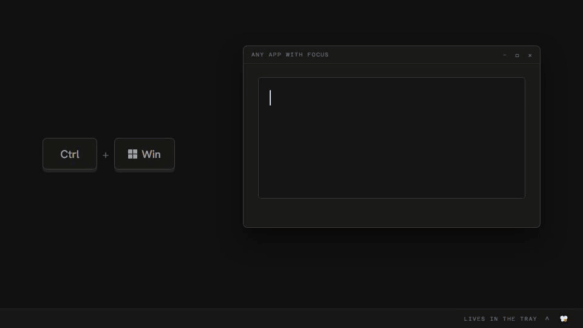

<p align="center"></p>

# Butterfly Speak

Voice dictation for Windows in English and 22 Indian languages: hold `Ctrl+Win`, speak,
release, and the text is typed into the app that has focus.

<p align="center"><a href="https://github.com/Deveshu04/Butterfly-Speak/releases/download/v0.2.0/butterfly-speak-launch.mp4"></a></p>
<p align="center"><a href="https://github.com/Deveshu04/Butterfly-Speak/releases/download/v0.2.0/butterfly-speak-launch.mp4">Watch the 43-second video</a></p>

## Install

Download the installer from [Releases](https://github.com/Deveshu04/Butterfly-Speak/releases).
It needs 64-bit Windows 10 or 11 and a CPU with AVX2.

The installer is not code-signed, so SmartScreen warns about an unknown publisher on first run:
choose **More info**, then **Run anyway**.

## Three ways to transcribe

You pick one at first run and can change it in **Settings → Speech engine**.

- **Cloud.** Sign in with Google. 2,000 words a week, free while in beta. Audio goes through the
  Butterfly Labs relay to Sarvam AI. Butterfly Labs keeps your Google sign-in details (e-mail
  address, name, profile picture link and Google account id), your sign-in sessions and your
  weekly usage counts, and no audio or text (see [Privacy](#privacy)). The relay's other limits
  are listed in [`relay/README.md`](relay/README.md).
- **Bring your own key.** Paste a Sarvam API key from
  [dashboard.sarvam.ai](https://dashboard.sarvam.ai). It is kept in Windows Credential Manager,
  and audio goes straight to Sarvam AI under your account.
- **On-device.** English only. Speech recognition runs on your CPU with
  [sherpa-onnx](https://github.com/k2-fsa/sherpa-onnx) models (104–482 MB, downloaded when you
  choose one), and AI Polish runs on a local 0.5B model. Audio stays on the machine unless you
  import a recording with a Sarvam key saved.

In all three, switching **Use for speech-to-text** on in **Settings → Custom endpoint** sends the
audio you dictate to your own AI endpoint instead.

## Features

- Push-to-talk dictation into any app: browser, editor, chat, terminal.
- Hands-free mode: double-tap the hotkey to start, tap it again to finish.
- English and 22 Indian languages through Sarvam AI, detected automatically or pinned to one.
- AI Polish (optional): Sarvam-105B in the cloud modes, or a 0.5B local model on-device, removes
  fillers, applies self-corrections and fixes grammar without changing the meaning.
- On-device mode (English) with a model picker that shows each model's RAM use, and an offline
  clean-up pipeline: filler-word removal, self-correction, punctuation and casing, number, time
  and date formatting, and spoken "new line" / "new paragraph".
- Nothing downloads unless you ask: the cloud modes need no model downloads.
- A floating pill shows a waveform and the listening status while you speak, not a running
  transcript.
- Lives in the system tray and can start with Windows.
- Updates itself: it checks a signed manifest half a minute after launch and every eight hours
  (you can turn this off), and installs nothing until you choose to.

## Build from source

You need Node 22.18 or later, pnpm, Rust stable (MSVC toolchain), Visual Studio Build Tools with
the C++ workload, CMake, and LLVM (the llama.cpp bindings need libclang). Then, from the
checkout:

```powershell
powershell -ExecutionPolicy Bypass -File scripts\vendor-sherpa.ps1 -SetUserEnv
# open a new terminal so it sees SHERPA_ONNX_LIB_DIR
pnpm install
pnpm tauri dev
```

`scripts\vendor-sherpa.ps1` downloads the prebuilt sherpa-onnx static libraries, checks their
SHA-256 and sets `SHERPA_ONNX_LIB_DIR` for your Windows user.

If the checkout path contains a space, some C++ build scripts fail. Set `CARGO_TARGET_DIR` to a
path without one, for example `$env:CARGO_TARGET_DIR = 'C:\build\butterfly-speak'`.

`powershell -ExecutionPolicy Bypass -File scripts\gate.ps1` runs every check: the Rust tests,
`cargo check --all-targets` (any warning fails it), `pnpm check`, `pnpm test` (the interface's
pure modules and the notes migration harness) and, once a bundle has fetched Tauri's
`makensis`, the uninstaller hook's harness. The first run builds everything, which takes 30
minutes or more and about 10 GB of disk.

`pnpm tauri build` produces the NSIS installer. It signs the update bundle with the key in
`TAURI_SIGNING_PRIVATE_KEY` and fails at the end without one; for a local installer, set
`bundle.createUpdaterArtifacts` to `false` in `src-tauri/tauri.conf.json`. A build with
`--no-default-features` leaves out on-device AI Polish and does not compile llama.cpp.

## Privacy

This is a summary. The full policy is at
[deveshu04.github.io/privacy.html](https://deveshu04.github.io/privacy.html).

Speak has no analytics and no telemetry. Nothing is sold, and nothing is shared for advertising.
What leaves your computer depends on the mode:

- **Cloud.** Your audio (with your Dictionary words as spelling hints) and the text sent to AI
  Polish, transforms, the voice agent, note actions, Auto-title and the prompt tester pass through
  the Butterfly Labs relay, on Cloudflare, to Sarvam AI. Butterfly Labs does not store them.
  Supabase (Mumbai) keeps what Google gives at sign-in (e-mail address, name, profile picture link
  and Google account id), your sign-in sessions (with the IP address and device description of
  each) and one word count per week, for as long as you have an account. The relay keeps this
  week's usage (and last week's, until its word count reaches Supabase), and erases it within
  about a week after the app last contacts it for your account. Your Google data is used only to
  sign you in, to show which account is signed in and, as a one-way keyed hash of your e-mail
  address, to keep the weekly allowance across an account deletion.
- **Bring your own key.** Your audio, your text and any recording you import go straight to
  Sarvam AI under your key. Nothing reaches Butterfly Labs.
- **On-device.** Speech is recognised, and AI Polish runs, on your computer, unless you switch
  your own AI endpoint on for speech-to-text. With a Sarvam key saved, importing a recording,
  the translate shortcut, transforms, the voice agent, note actions, Auto-title and the prompt
  tester still send their recording or text to Sarvam AI.

In every mode:

- With a Sarvam key saved, an imported recording is uploaded, through a link Sarvam AI issues, to
  storage Sarvam provides (currently on Microsoft Azure).
- Your own AI endpoint, if you set one up in **Settings → Custom endpoint**, receives the audio
  or text you switch it on for, in place of the service above.
- The app checks GitHub for updates (you can turn this off), and downloads speech models from
  GitHub and the AI Polish model from Hugging Face only when you ask.
- Speak types by briefly placing the text on the clipboard, then puts back the text that was
  there; anything else on the clipboard, such as an image, is replaced. Undo AI Edit pastes the
  raw transcript the same way when it can undo in place, and otherwise leaves it copied on the
  clipboard. Outside a terminal, transforms, and sometimes the voice agent, press Ctrl+C to read
  the text you selected, then put back the text the clipboard held.

On your computer, Speak keeps your settings (with your Dictionary, snippets and learned
corrections) and small files beside them (your theme, when it last checked for updates, whether
it has shown its background notice, when it last restarted after its web view failed), your
dictation history for as long as **Settings → System** says, your notes, the counts behind
Insights, the models you downloaded, and logs, which it deletes once they are a week old. Saved
keys and your Cloud sign-in are kept in Windows Credential Manager; **Remove** next to a saved key
deletes it.

Ticking **Delete the application data** when you uninstall removes this data, except the notes
folder you chose, any notes or settings files you exported, anything reached through a link and
the few other cases the policy lists. Without the tick, everything stays. Uninstalling does not
sign you out of Cloud mode on Supabase's side, so sign out or delete your account first.

To delete your Cloud account, use
**Settings → Speech engine → Cloud → Delete my Cloud account**. If you can no longer sign in,
open an issue at
[github.com/Deveshu04/Deveshu04.github.io/issues](https://github.com/Deveshu04/Deveshu04.github.io/issues)
without your e-mail address; the reply there says how to confirm it privately. Supabase backups
can hold an account for up to 7 days, and Cloudflare's recovery history for up to 30.

## Contributing

See [CONTRIBUTING.md](CONTRIBUTING.md). Contributions are accepted under the
[Contributor License Agreement](CLA.md), which you sign with a comment on your first pull
request.

## Licence

[AGPL-3.0-only](LICENSE). The third-party works Butterfly Speak contains, links or downloads are
listed in [THIRD_PARTY_NOTICES.md](THIRD_PARTY_NOTICES.md); the licences of its Rust crates and npm
packages are in [THIRD_PARTY_LICENSES.html](THIRD_PARTY_LICENSES.html).

## Credits

- [Sarvam AI](https://www.sarvam.ai) (Saaras speech-to-text, Sarvam-105B)
- [sherpa-onnx](https://github.com/k2-fsa/sherpa-onnx) (Apache-2.0)
- [ONNX Runtime](https://github.com/microsoft/onnxruntime) (MIT)
- [Moonshine](https://github.com/moonshine-ai/moonshine) (MIT)
- [NVIDIA Parakeet TDT-CTC 110M and TDT 0.6B v2](https://huggingface.co/nvidia/parakeet-tdt-0.6b-v2) (CC BY 4.0)
- [Edge-Punct-Casing punctuation model](https://github.com/frankyoujian/Edge-Punct-Casing) (Apache-2.0)
- [Qwen2.5-0.5B-Instruct](https://huggingface.co/Qwen/Qwen2.5-0.5B-Instruct-GGUF) (Apache-2.0)
- [llama.cpp](https://github.com/ggml-org/llama.cpp) (MIT)
- [Tauri](https://tauri.app) (MIT/Apache-2.0)
- [Feather Icons](https://github.com/feathericons/feather) (MIT)

The full list, with the components these contain, is in
[THIRD_PARTY_NOTICES.md](THIRD_PARTY_NOTICES.md).
