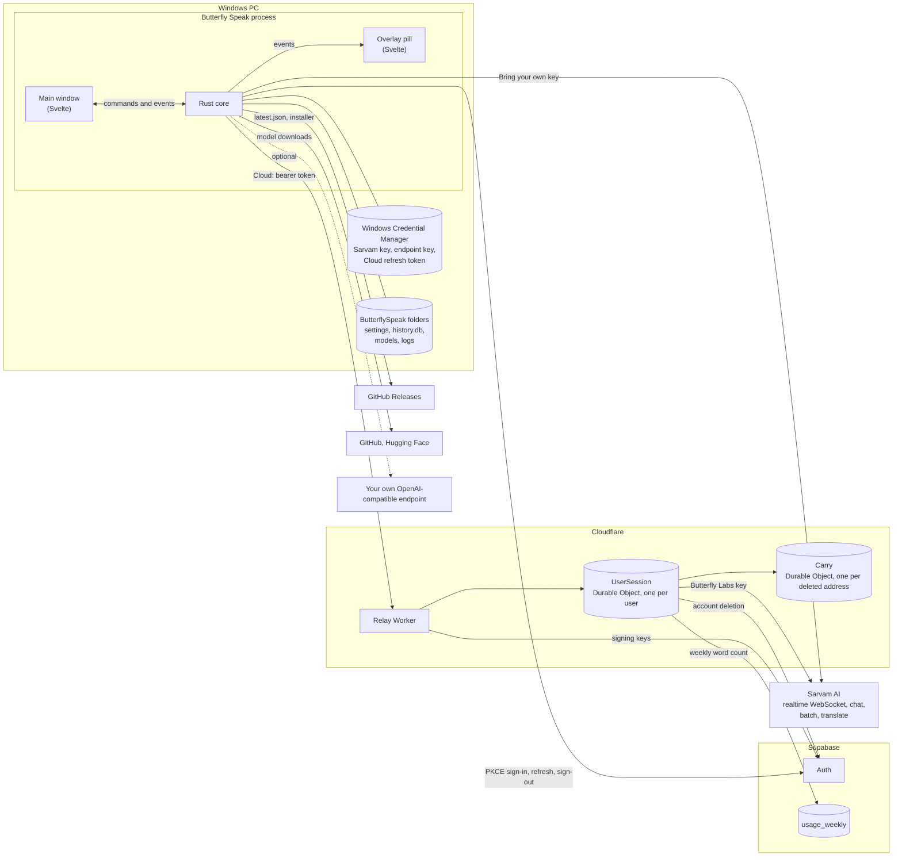

# Architecture

Butterfly Speak is a Tauri 2 application for 64-bit Windows. A Rust core captures audio,
transcribes it, cleans up the text, types it into the focused app and stores everything the app
keeps. Two WebView2 windows run the Svelte interface. The interface makes no network requests
of its own: its content security policy allows connections only to the Tauri IPC bridge, so
every request to a server is made by the Rust core.

| Path | What it holds |
|---|---|
| `src-tauri/src` | The Rust core |
| `src` | The Svelte interface: `routes/+page.svelte` is the main window, `routes/overlay` the pill |
| `relay` | The Cloudflare Worker behind Cloud mode |
| `supabase/migrations` | The Supabase schema Cloud mode uses |
| `src-tauri/windows` | The NSIS installer hooks and their test harness |
| `scripts` | `vendor-sherpa.ps1` fetches the sherpa-onnx libraries; `gate.ps1` runs every check |
| `tools/latency` | Live latency probes against Sarvam and the relay |
| `tests/fixtures` | The formatting benchmark's corpus |
| `tests/web` | Tests for the interface's pure modules |

To build and run it, see [Build from source](../README.md#build-from-source); before a pull
request, see [CONTRIBUTING.md](../CONTRIBUTING.md).

## Processes and services

The two windows are declared in `src-tauri/tauri.conf.json`. Each has its own capability file in
`src-tauri/capabilities`, which lists the commands it may call; no window holds a permission for
the updater, the file system or the shell.

Keys and the Cloud refresh token live in Windows Credential Manager and never reach the webview
or `settings.json`; the webview learns only whether a key is present and its last characters.
Settings live in `%APPDATA%\ButterflySpeak` (`settings.json`, `history.db`); models and logs
live in `%LOCALAPPDATA%\ButterflySpeak`.

Inside the process, each resource has one owning thread and the rest talk to it over channels:
the keyboard hook, the microphone pump, the controller, the on-device recognizer, the Sarvam
dispatcher (a task on Tauri's async runtime), the custom-endpoint transcriber, the SQLite
connection and the UI Automation worker.

## The Rust modules

**Wiring.** `lib.rs` registers the Tauri plugins (single instance, autostart, notifications,
opener, dialog, updater, deep link), starts the threads above and builds the tray. `state.rs`
defines `ControlMsg`, the one message type the controller consumes. `events.rs` names the
events shared with `src/lib/events.ts`. `commands.rs` is the command surface the main window
calls; the Cloud commands live in `auth::commands` and the updater commands in `updater`.

**The dictation loop.** `controller.rs` is the state machine: idle, recording, finalizing,
injecting. It owns the utterance buffer, push-to-talk and hands-free, the overlay, finalization
and injection. `hotkeys.rs` runs the low-level keyboard hook that detects modifier-only chords
such as `Ctrl+Win`. `audio.rs` captures the microphone with cpal, resamples to 16 kHz mono and
sends 100 ms chunks while the gate is open, keeping 300 ms of pre-roll. `speech_gate.rs` drops
recordings with no audible window. `tones.rs` plays the start and stop cues, `media.rs` pauses
media players during a dictation when **Pause media while dictating** is on (it is off by
default), `overlay.rs` positions the pill without ever
taking focus, and `system_events.rs` cancels a recording when the session locks and drops a cloud session
that did not survive sleep.

**Speech.** `sarvam/` is everything that talks to Sarvam: `ws.rs` runs one realtime session per
dictation, `codec.rs` builds the URL and frames, `incremental.rs` cuts the growing transcript
into chunks for polishing while the user speaks, `chat.rs` makes the polish, transform and agent
calls, `batch.rs` is the one-shot fallback for a realtime session that failed, `batch_job.rs`
transcribes imported files, `translate.rs` calls `/translate`, `key.rs` stores credentials and
`net_error.rs` classifies network failures. The `Lane` type decides whether a request goes to
Sarvam with the user's key or to the relay with a sign-in token. `asr/offline.rs` runs the
on-device sherpa-onnx models and the local polish model on one thread; `asr/custom.rs` sends a
whole recording to the user's own `/audio/transcriptions` endpoint.

**Text.** `cleanup/` is the deterministic pipeline: spoken commands, fillers, self-corrections,
number and date formatting, the punctuation model, corrections and snippets, tidy and tone.
`cleanup/polish.rs` runs Qwen2.5-0.5B-Instruct through llama.cpp, behind the default `polish`
feature. `format/` holds the provider-agnostic chat backend, the cleanup levels, the guardrail
that rejects a model reply which loses the user's words or grows far past them, the SHA-256 pins on every shipped
prompt, and per-stage timing. `canonical.rs` compares text that differs only in Unicode form.

**Where text goes.** `routes/` decides what a finished dictation becomes, from the chord that
started it: typed text, a translation, or the voice agent's answer, including the wake phrase
and the agent's edit of selected text. `transforms.rs` rewrites selected text in place.
`injection.rs` pastes through the clipboard and restores it; `foreground.rs` records the target
window at chord-down and brings it back; `uia/` reads field contents and selections through UI
Automation and refuses password fields.

**Learning.** `learn/` watches the field a paste went into, finds words the user retyped, and
turns a correction seen in two separate pastes within 30 days into a replacement rule.

**Storage.** `settings.rs` owns `settings.json`. `history/` keeps dictation history in SQLite
with FTS5 search and a retention sweep. `notes/` stores notes, folders and note actions in the
same database, with an optional Markdown mirror. `import/` queues audio files for Sarvam's batch
job API; `media/probe.rs` and `media/decode.rs` check and convert them first. `models/`
downloads catalogued models, verifies their SHA-256 and estimates RAM use.

**Accounts and updates.** `auth/` signs in to Butterfly Labs through Supabase with PKCE and
keeps the refresh token in Credential Manager. `endpoint/` validates and probes the custom
OpenAI-compatible endpoint. `updater.rs` schedules update checks and installs on request.

**Housekeeping.** `logs.rs` writes one log file per day and deletes files older than a week;
`crash_recovery.rs` reloads a window whose WebView2 renderer died; `theme.rs` paints the window
background before the webview's first frame; `autostart.rs` reads launch-at-login state from the
registry; `tray.rs` builds the tray menu.

**Benchmarks.** `eval/` scores formatting (punctuation error rate, casing F1, disfluency F1,
WER) and `bin/fmtbench.rs` runs those scores over `tests/fixtures`; see
[benchmarks.md](benchmarks.md).

## The relay and Supabase

The relay is described in [cloud-mode.md](cloud-mode.md) and, in full, in
[`relay/README.md`](../relay/README.md). Supabase provides Google sign-in and one table,
`usage_weekly`, which the relay writes and each signed-in user may read for their own rows.
